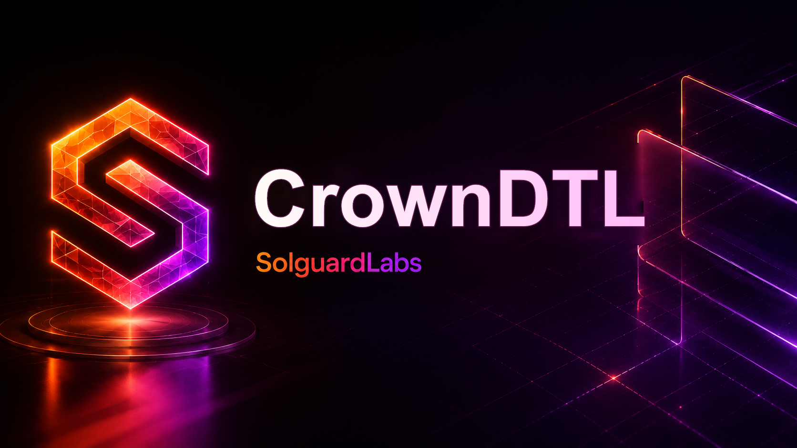

# Crown DTL



Crown DTL es un motor Rust para redenciones priorizadas de vaults DTL. Modela
colas VIP, colas estandar, ventanas de unlock, limites diarios por usuario,
capacidad de prioridad por epoch y liquidacion de withdrawals contra reservas
del vault.

El protocolo esta organizado como un nucleo de libreria con un binario de
escenarios deterministas. Los tests JavaScript consumen esos escenarios para
validar el contrato observable del sistema sin depender de servicios externos.

## Componentes

- `accounts`: cuentas, tiers y portfolios de shares/assets.
- `amount`: importes enteros y operaciones aritmeticas comprobadas.
- `asset`: metadata y registro de activos.
- `clock`: dias de epoch y ventanas de unlock.
- `policy`: limites diarios, capacidad prioritaria y politicas de ticket.
- `queue`: ordenacion de cola por lane, tier y secuencia.
- `priority`: libro de claims economicos pendientes de unlock.
- `vault`: estado de reservas, shares y tickets de redencion.
- `engine`: orquestacion transaccional de request, cancel, process y withdraw.
- `runtime`: escenarios CLI usados por la suite JavaScript.
- `calibration`: catalogo operativo de perfiles de capacidad por ventana.

## Flujo de redencion

1. Un usuario con shares solicita una redencion estandar o prioritaria.
2. El motor valida limites diarios, elegibilidad de lane y capacidad disponible.
3. Las shares quedan debitadas y el ticket entra en la cola del vault.
4. El procesador del vault agenda tickets por prioridad economica.
5. Tras la ventana de unlock, el usuario retira assets contra el claim maduro.
6. El journal registra eventos e invariantes de conservacion de shares y
   cobertura de claims.

## Requisitos

- Rust estable con `cargo`, `rustfmt` y `clippy`.
- Node.js 20 o superior para los tests JavaScript.

No hay dependencias Rust externas ni paquetes npm obligatorios.

## Comandos

Ejecutar tests Rust:

```bash
cargo test --locked
```

Ejecutar tests JavaScript:

```bash
node --test tests/node/*.test.js
```

Ejecutar la validacion completa:

```bash
bash scripts/ci.sh
```

Ejecutar escenarios manuales:

```bash
cargo run --quiet -- scenario order
cargo run --quiet -- scenario limits
cargo run --quiet -- scenario cancel
cargo run --quiet -- scenario withdrawals
```

## Estructura

```text
src/                 Nucleo Rust del protocolo
tests/redemption_flow.rs
tests/node/          Tests JavaScript de escenarios
tests/helpers/       Helpers de ejecucion CLI
scripts/             Tests y CI local
.github/             Workflow CI y Dependabot
.vscode/             Tareas y configuracion de editor
```

## CI

La pipeline ejecuta formato, build, tests Rust, clippy y tests JavaScript. Los
scripts locales usan rutas relativas y no requieren servicios externos.

## Estado

Repositorio preparado como laboratorio de auditoria de logica economica para
redenciones DTL priorizadas.
