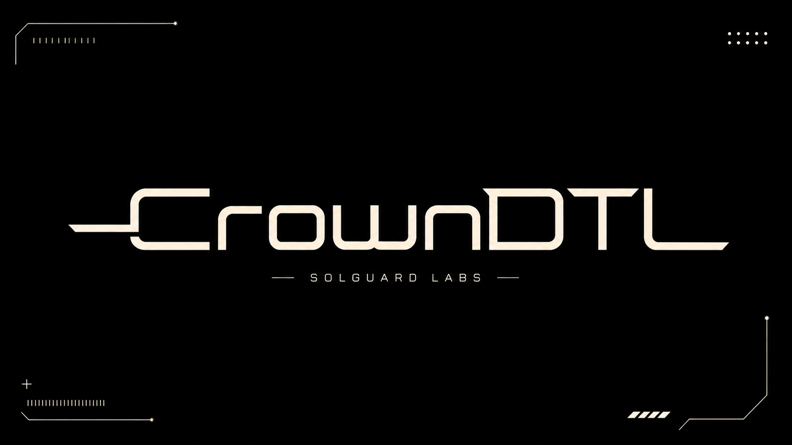
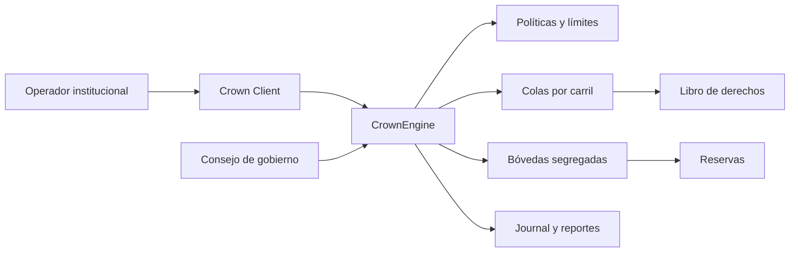
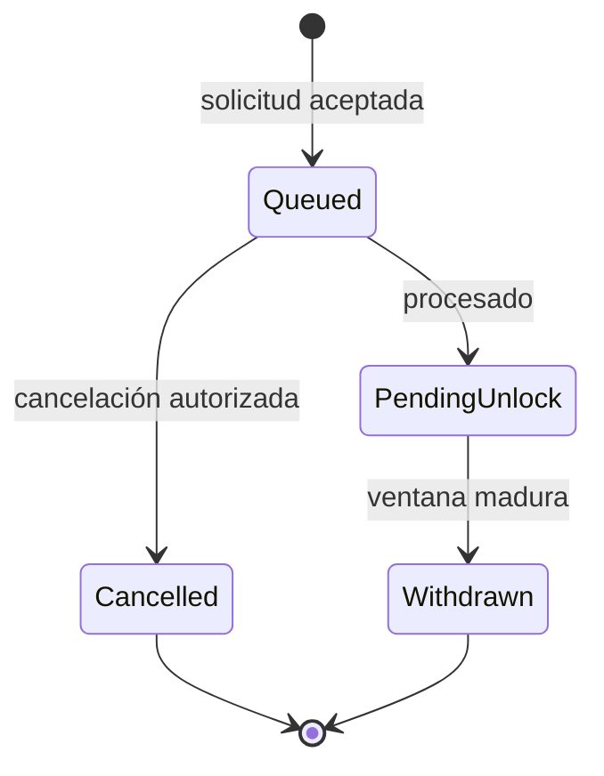

# CrownDTL



CrownDTL es un motor determinista de redenciones para tesorerías tokenizadas. Coordina cuentas por nivel de servicio, bóvedas con reservas segregadas, dos carriles de salida, ventanas de desbloqueo y liquidación íntegra. El núcleo Rust conserva importes como enteros comprobados; el cliente JavaScript replica los cálculos de capital con `BigInt` y transporta órdenes idempotentes.

La versión `1.0.0` fija el contrato operativo, el modelo de capital y el proceso de promoción entre `main`, `production` y el artefacto publicado.

## Vista del sistema


```mermaid
flowchart LR
    O["Operador institucional"] --> C["Crown Client"]
    C --> E["CrownEngine"]
    E --> P["Políticas y límites"]
    E --> Q["Colas por carril"]
    E --> V["Bóvedas segregadas"]
    Q --> K["Libro de derechos"]
    V --> R["Reservas"]
    E --> J["Journal y reportes"]
    G["Consejo de gobierno"] --> E
```


```mermaid
stateDiagram-v2
    [*] --> Queued: solicitud aceptada
    Queued --> PendingUnlock: procesado
    Queued --> Cancelled: cancelación autorizada
    PendingUnlock --> Withdrawn: ventana madura
    Cancelled --> [*]
    Withdrawn --> [*]
```

## Propiedades económicas

- Contabilidad entera sin coma flotante para shares, reservas, límites y capacidad.
- Redondeo conservador: haircuts a la baja; shocks y buffers al alza.
- Priorización estable por carril, nivel de cuenta y secuencia de llegada.
- Límite diario por cuenta, bóveda y día de epoch.
- Capacidad prioritaria por bóveda y día, independiente del límite individual.
- Reporte de cobertura, liquidez, concentración HHI y utilización prioritaria.
- Operaciones administrativas con quorum, timelock, caducidad y predecesores.

Para una bóveda `v`, CrownDTL evalúa:

```text
reserva_efectiva = floor(reserva × (10 000 − haircut_bps) / 10 000)
claims_estresados = ceil(claims × (10 000 + shock_bps) / 10 000)
buffer_operativo = ceil(shares × buffer_bps / 10 000)
reserva_requerida = claims_estresados + buffer_operativo
```

Una ruta es conforme cuando la reserva efectiva y los activos líquidos cubren la reserva requerida. [El modelo económico](./docs/modelo-economico.md) documenta los supuestos y ejemplos completos.

## Componentes

| Superficie | Responsabilidad |
| --- | --- |
| `src/engine.rs` | Orquestación transaccional de solicitudes, cola y liquidación |
| `src/capital.rs` | Métricas por bóveda y agregación de cartera |
| `src/governance.rs` | Identidad canónica, quorum, timelock y ejecución |
| `src/policy.rs` | Límites diarios y capacidad prioritaria |
| `src/priority.rs` | Derechos económicos y madurez temporal |
| `src/vault.rs` | Reservas, shares y ciclo de tickets |
| `src/reports.rs` | Vistas deterministas para operación y conciliación |
| `sdk/crownClient.js` | Transporte HTTPS, idempotencia y paridad matemática |

## Inicio rápido

Requisitos: Rust estable con `rustfmt` y `clippy`, y Node.js 20 o superior.

```bash
npm ci
npm run ci
```

Ejecutar escenarios observables:

```bash
cargo run --quiet -- scenario order
cargo run --quiet -- scenario limits
cargo run --quiet -- scenario cancel
cargo run --quiet -- scenario withdrawals
```

Consumir el cálculo de capital:

```js
import { evaluateCapital } from "./sdk/crownClient.js";

const metrics = evaluateCapital({
  vault: "vault:senior",
  reserveAssets: 1_000_000n,
  liquidAssets: 800_000n,
  totalShares: 900_000n,
  openClaims: 300_000n,
  priorityCapacity: 500_000n,
  reserveHaircutBps: 500n,
  claimShockBps: 2_000n,
  operationalBufferBps: 800n,
});
```

## Documentación

- [Arquitectura](./docs/arquitectura.md)
- [Modelo económico](./docs/modelo-economico.md)
- [Ciclo de redención](./docs/ciclo-redencion.md)
- [Integración](./docs/integracion.md)
- [Operaciones](./docs/operaciones.md)
- [Observabilidad](./docs/observabilidad.md)
- [Gobernanza](./docs/gobernanza.md)
- [Política de seguridad](./SECURITY.md)

## Calidad y promoción

`npm run ci` comprueba formato, compilación, Clippy estricto, pruebas Rust y Node, inventario documental, identidad del banner, profundidad del código y auditoría de dependencias. CI ejecuta la misma secuencia en Linux y Windows. Una publicación válida mantiene el mismo commit en `main`, `production`, el tag anotado `v1.0.0` y la release `Production 1.0.0`.

## Licencia

[MIT](./LICENSE).
