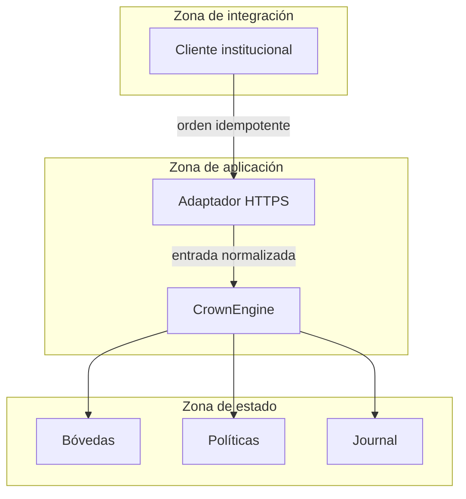
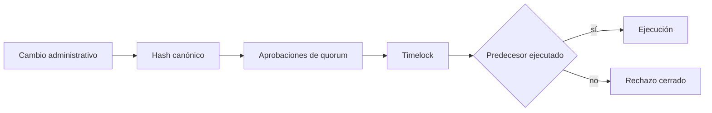
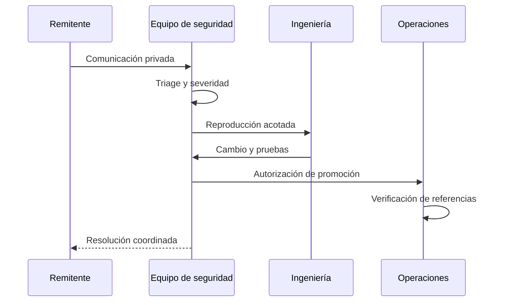

# Política de seguridad

## Versiones mantenidas

| Versión | Estado | Canal |
| --- | --- | --- |
| `1.0.x` | Mantenida | `production` |
| `< 1.0.0` | Fuera de soporte | — |

El tag de una publicación debe apuntar al mismo commit que `main` y `production`. El workflow `Release integrity` verifica esa cadena en cada promoción.

## Comunicación responsable

Utiliza **Security → Report a security issue** en GitHub para comunicar de forma privada cualquier comportamiento que afecte a autorización, integridad contable, disponibilidad o confidencialidad. No abras una issue pública con detalles operativos.

Incluye versión y commit, precondiciones, componente, impacto, evidencia mínima y una propuesta de propiedad que debería preservarse. No incluyas credenciales, claves, datos personales ni material de terceros. El equipo confirmará recepción, clasificará el caso y coordinará la corrección y la divulgación.

## Fronteras de confianza

## Controles obligatorios

- Entradas normalizadas, dominios explícitos e identificadores acotados.
- Operaciones aritméticas comprobadas y redondeo documentado.
- HTTPS, rechazo de redirecciones e idempotencia para escrituras del cliente.
- Quorum, timelock, caducidad y relación de predecesores para administración.
- Conciliación entre reservas, shares, tickets, derechos y journal.
- Dependencias bloqueadas y auditoría automática en cada cambio.
- Revisión mediante CODEOWNERS para núcleo, CI y política de seguridad.

## Matriz de revisión

| Área | Propiedad | Evidencia automática |
| --- | --- | --- |
| Reservas | Cobertura suficiente bajo estrés | pruebas de `capital` |
| Redenciones | Transiciones válidas y orden estable | pruebas Rust de integración |
| Cliente | Precisión entera e idempotencia | pruebas Node del SDK |
| Gobierno | Operaciones únicas, maduras y aprobadas | pruebas de `governance` |
| Promoción | Referencias en un único commit | workflow de integridad |

## Respuesta operativa

