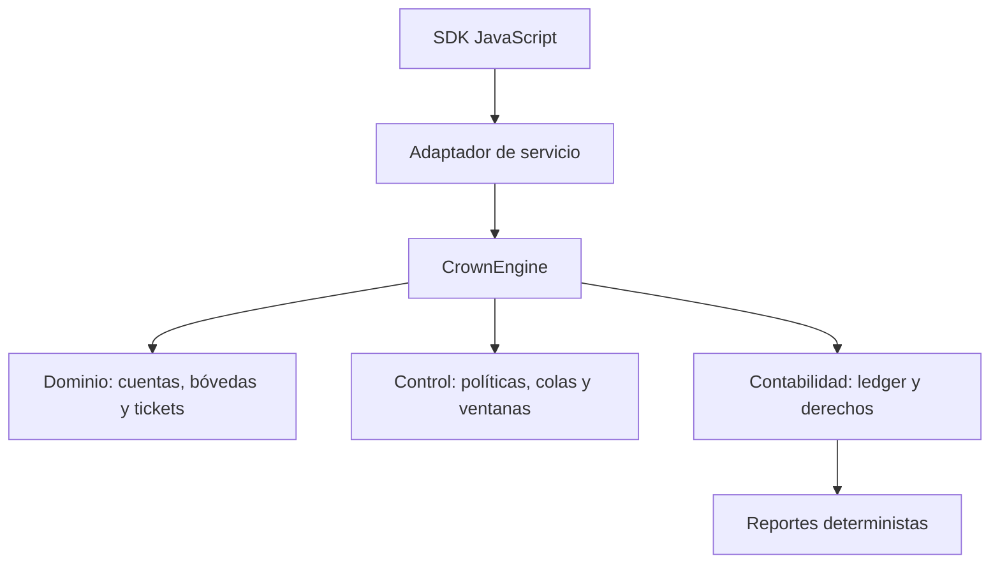
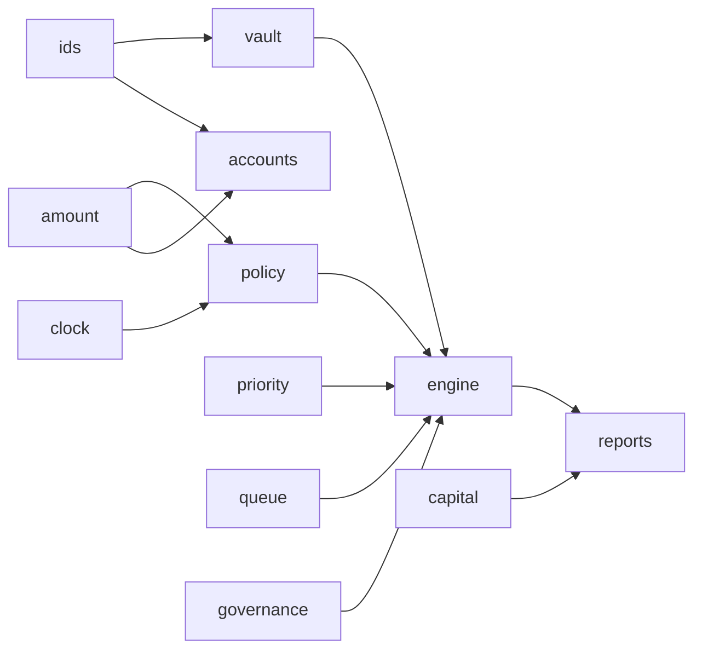
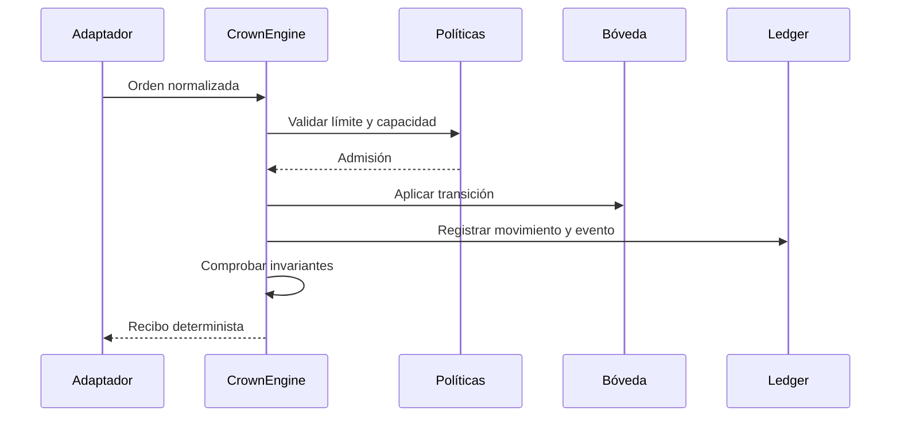

# Arquitectura de CrownDTL

## Objetivo

CrownDTL separa decisión, contabilidad y observación. `CrownEngine` es la frontera transaccional: recibe una orden ya autenticada, consulta políticas, modifica los registros económicos y ejecuta las invariantes antes de devolver un recibo. Los módulos no realizan llamadas de red ni leen el reloj del sistema; el día de epoch se inyecta para que cada transición sea reproducible.

## Capas

El adaptador no forma parte del núcleo y debe convertir autenticación y transporte a tipos del dominio. El motor conserva el orden de escritura. `Amount`, `Rate` y `BasisPoints` centralizan límites y operaciones comprobadas. Los identificadores tipados evitan mezclar cuentas, activos, bóvedas, ventanas y redenciones.

## Dependencias internas

`PriorityBook` representa derechos pendientes; `VaultState` mantiene reservas, shares y tickets; `ProtocolLedger` conserva límites, capacidad y eventos. La orquestación debe revisar los tres planos como una sola unidad económica.

## Escritura transaccional

Si una operación falla, el llamador no debe publicar un recibo parcial. Para persistencia externa, se recomienda ejecutar sobre una copia de estado, confirmar invariantes y escribir mediante compare-and-swap con el número de versión observado.

## Escalabilidad y aislamiento

La clave natural de partición es `VaultId`. Las cuentas pueden mantener posiciones en varias bóvedas, por lo que los procesos de conciliación agregada deben trabajar sobre snapshots consistentes. Las colas usan secuencias monotónicas por motor; un adaptador distribuido debe serializar escrituras de una misma bóveda o emplear control optimista.

La lectura de reportes no concede autoridad de escritura. La configuración de política se administra por operaciones de gobierno con identidad canónica y no mediante parámetros libres en cada solicitud.
