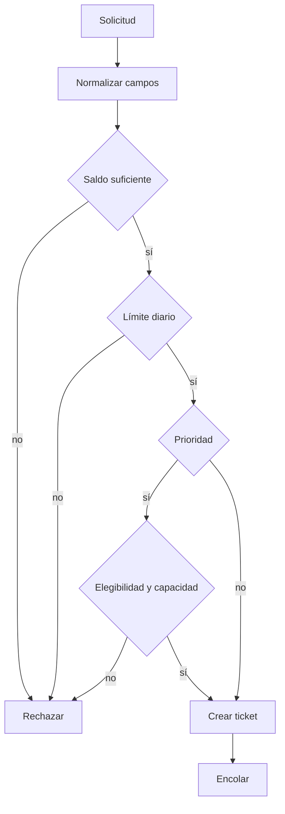
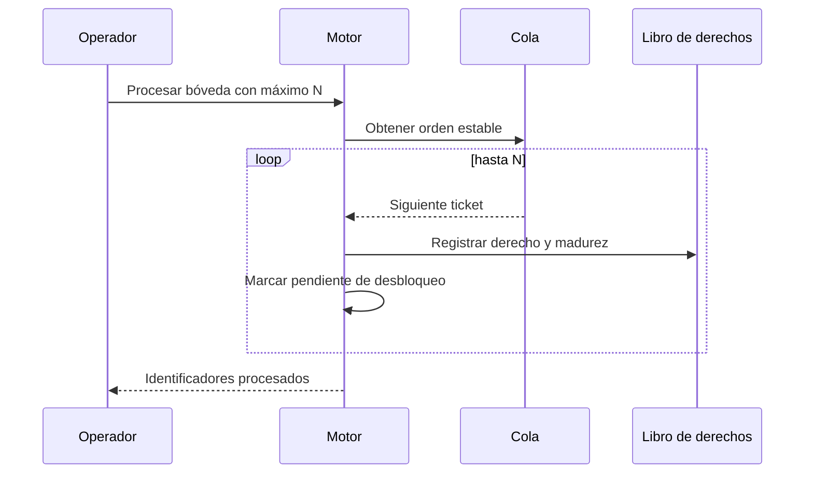
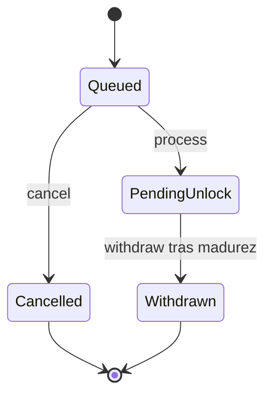

# Ciclo de redención

## Admisión

Una orden declara cuenta, bóveda, importe en shares, carril y ventana. El motor comprueba existencia, importe mínimo y máximo, saldo, elegibilidad del nivel, profundidad de cola, límite diario y, para prioridad, capacidad disponible. La cotización queda fijada en el ticket para que el resultado no dependa de lecturas posteriores.

El recibo contiene `redemption_id`, activos cotizados, día de desbloqueo, ventana y carril. El identificador es la referencia estable para operaciones posteriores; el adaptador debe asociar su clave de idempotencia con ese recibo.

## Orden y procesado

El carril prioritario precede al estándar. Dentro de prioridad, los niveles institucional y VIP conservan su orden económico; la secuencia resuelve empates. `max_tickets` limita el trabajo por ejecución y permite dimensionar ciclos operativos predecibles.

## Estados

Las transiciones terminales no se reabren. Una cancelación solo es admisible mientras el ticket sea cancelable; una retirada solo se admite tras la madurez declarada. El journal conserva los eventos que explican cada cambio.

## Conciliación por cierre

Al terminar un ciclo se captura `ProtocolReport`. Para cada bóveda se contrastan reserva, shares, activos pendientes, profundidad de cola, derechos abiertos y recuento de tickets por estado. Para cada cuenta se contrastan posiciones de shares y activos.

Lista mínima de cierre:

1. La cola procesada coincide con el máximo solicitado y el orden esperado.
2. Los derechos abiertos coinciden con posiciones pendientes de desbloqueo.
3. La reserva líquida cubre la reserva requerida del modelo de capital.
4. Los contadores de límite y capacidad explican el flujo del día.
5. El número de eventos avanzó conforme a las transiciones confirmadas.

Los escenarios `order`, `limits`, `cancel` y `withdrawals` ofrecen salidas JSON estables para automatizar estas comprobaciones sin depender de servicios externos.
