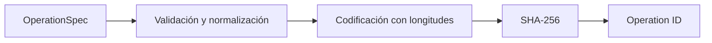
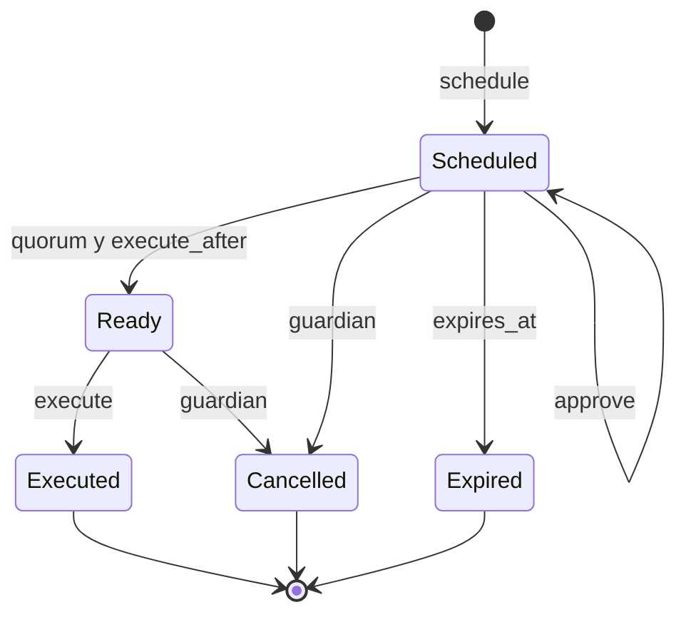
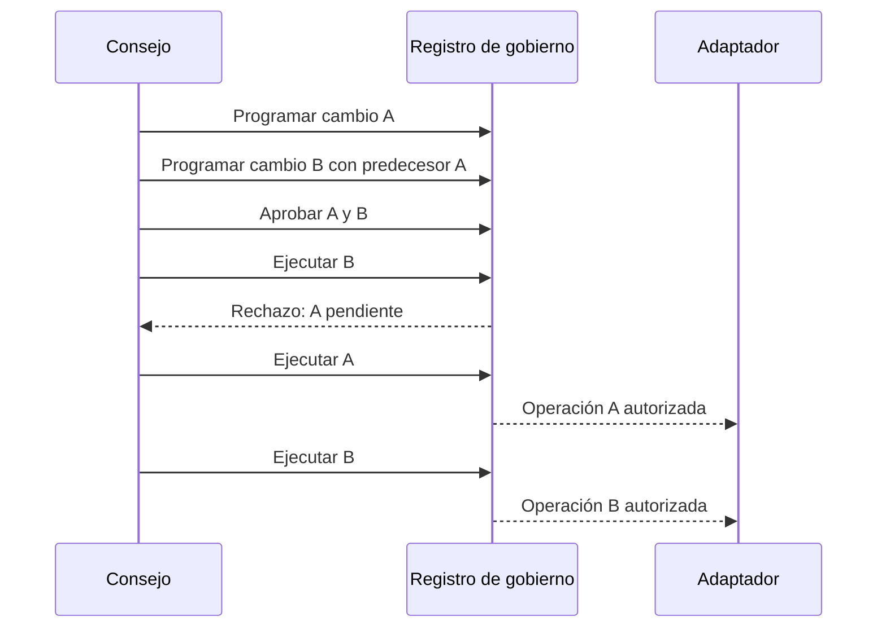

# Gobernanza

## Identidad de operación

Una operación administrativa se describe mediante dominio, red, destino, método, hash del payload, salt, inicio de ejecución, caducidad y predecesor opcional. `OperationSpec::canonical_bytes` codifica cada campo con prefijo de longitud; SHA-256 produce un identificador reproducible sin ambigüedad de concatenación.

El dominio y la red impiden reutilizar una autorización en otro contexto. El salt permite distinguir dos cambios con el mismo payload. El hash del payload debe calcularse sobre la representación canónica que consuma el adaptador de ejecución.

## Quorum y tiempo

El proponente debe ser gobernador y aporta la primera aprobación. Las aprobaciones son un conjunto, por lo que repetir una firma no incrementa quorum. `execute` falla antes de `execute_after`, tras `expires_at`, con quorum insuficiente o con una dependencia pendiente.

## Operaciones encadenadas

Los predecesores sirven para cambios donde una política depende de capacidad o ventanas previamente instaladas. El adaptador debe comprobar que el `OperationRecord` devuelto está en `Executed` y que `id` coincide con el payload que va a aplicar.

## Política recomendada

| Clase | Quorum | Timelock mínimo | Caducidad |
| --- | ---: | ---: | ---: |
| Parámetros de observación | 2/3 | 6 h | 48 h |
| Límites y capacidad | 3/5 | 24 h | 72 h |
| Activos y bóvedas | 4/7 | 48 h | 96 h |
| Pausa operativa | guardián | inmediata | decisión puntual |

Los valores son una referencia inicial y deben ajustarse al dominio de despliegue. El guardián solo cancela operaciones pendientes; no ejecuta cambios ni modifica payloads.

## Evidencia

Para cada cambio se conserva `OperationSpec`, ID, aprobadores, timestamps, estado terminal, commit de configuración y reporte posterior. Nunca se debe sustituir el payload después de obtener aprobaciones: cualquier cambio genera otro hash y otra operación.
