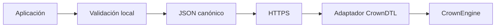
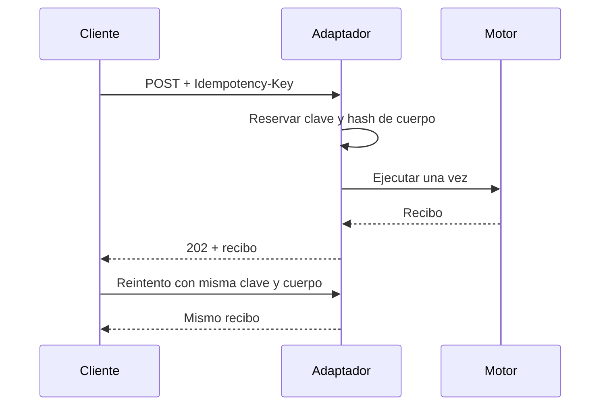
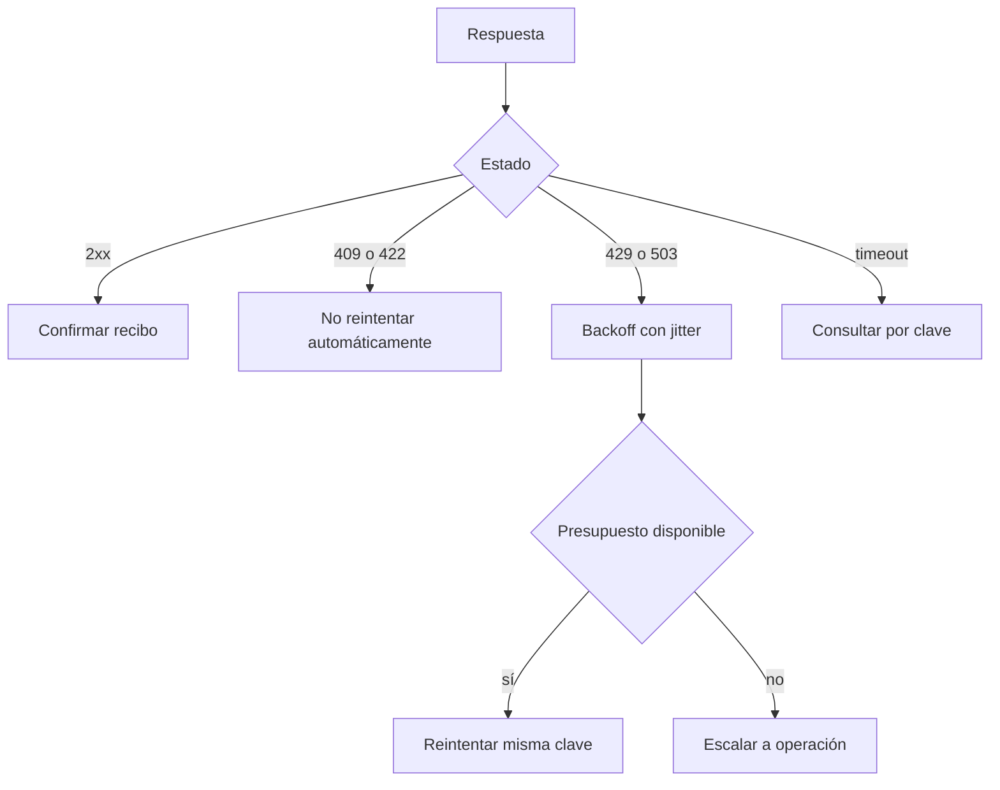

# Integración

## Contrato del cliente

`sdk/crownClient.js` proporciona cálculo de capital y un cliente de transporte. Los importes son `BigInt` y se serializan como literales enteros mediante JSON canónico. El cliente exige HTTPS, rechaza credenciales en URL y desactiva redirecciones automáticas.



Ejemplo de solicitud:

```js
import { CrownClient } from "./sdk/crownClient.js";

const client = new CrownClient({
  baseUrl: "https://api.crowndtl.example/settlement/",
  timeoutMs: 8_000,
});

const receipt = await client.submitRedemption(
  {
    accountId: "account:treasury",
    vaultId: "vault:senior",
    windowId: "window:eu-1",
    shares: 250_000n,
    kind: "priority",
  },
  { idempotencyKey: "redemption-20260815-0001" },
);
```

## Idempotencia



Una misma clave con un cuerpo diferente debe responder con conflicto. El adaptador conserva la asociación durante un periodo superior al máximo de reintento del cliente. No se reutilizan claves entre creación, cancelación y retirada.

## Superficie HTTP de referencia

| Método | Ruta | Función |
| --- | --- | --- |
| `GET` | `/v1/state` | Snapshot operativo |
| `POST` | `/v1/redemptions` | Crear redención |
| `POST` | `/v1/redemptions/{id}/cancellation` | Cancelar ticket admisible |
| `POST` | `/v1/withdrawals` | Retirar posiciones maduras |

Los errores usan JSON con `code` y `message`. Los códigos son estables; los mensajes son humanos. Se recomienda `409` para conflicto de estado o capacidad, `422` para entrada semántica y `503` cuando no se puede confirmar la escritura.

## Reintentos



El timeout no demuestra que la escritura haya fallado. La recuperación consulta primero el recibo asociado a la clave y solo después reenvía el mismo cuerpo. El máximo de intentos, el backoff y el presupuesto se configuran fuera del núcleo.

## Compatibilidad

La API pública de la serie `1.0.x` mantiene nombres y semántica. Añadir campos de respuesta es compatible si los consumidores ignoran propiedades desconocidas. Cambiar redondeo, estado o significado de un campo requiere una nueva versión mayor.
