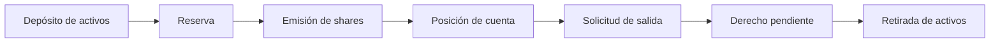
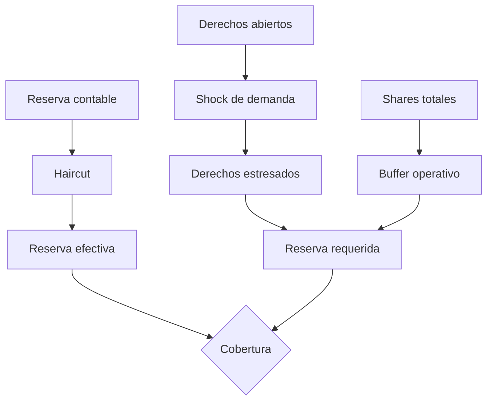
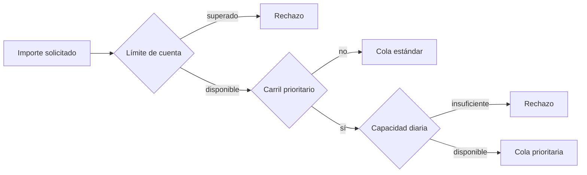
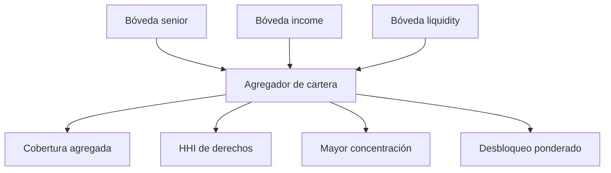

# Modelo económico

## Unidades y conservación

Cada bóveda tiene un activo subyacente, una reserva denominada en la unidad mínima de ese activo y un suministro de shares. CrownDTL no usa coma flotante. Las conversiones se hacen con enteros y una dirección de redondeo explícita.



La cotización base mantiene proporcionalidad:

```text
activos_cotizados = floor(shares_solicitadas × reserva / shares_totales)
```

Una reserva o un suministro nulos se rechazan cuando impiden una cotización bien definida. Las comisiones prioritarias se expresan en basis points y se aplican de forma determinista.

## Estrés de capital

La evaluación combina tres ajustes: haircut de reserva, shock sobre derechos abiertos y buffer operativo sobre shares. Los ajustes protectores redondean en contra de sobrestimar cobertura.



Ejemplo para una bóveda senior:

| Entrada | Valor |
| --- | ---: |
| Reserva | 1.000.000 |
| Activos líquidos | 800.000 |
| Shares | 900.000 |
| Derechos abiertos | 300.000 |
| Haircut | 500 bps |
| Shock | 2.000 bps |
| Buffer | 800 bps |

El resultado es reserva efectiva `950.000`, derechos estresados `360.000`, buffer `72.000` y reserva requerida `432.000`. La ruta queda conforme porque tanto `950.000` como `800.000` superan el requisito.

## Capacidad y límites



El límite de cuenta impide concentrar solicitudes en una misma combinación de cuenta, bóveda y día. La capacidad prioritaria limita el conjunto de esa bóveda durante el epoch. Ambos registros exponen consumido, liberado y neto para que una conciliación distinga flujo bruto de posición activa.

## Concentración de cartera

Para derechos `c_i` y total `C`, el HHI se calcula con participaciones en bps:

```text
participación_i = floor(c_i × 10 000 / C)
HHI_bps = Σ floor(participación_i² / 10 000)
```



El HHI no reemplaza los límites por bóveda: es una señal adicional para dimensionar liquidez y ventanas. Si no hay derechos abiertos, concentración y desbloqueo ponderado son cero.

## Supuestos

- Las reservas reportadas corresponden al mismo snapshot que los derechos.
- `liquid_assets` nunca supera `reserve_assets`.
- Los parámetros en bps son aprobados por gobierno y versionados.
- El valor de una unidad mínima es homogéneo dentro de una bóveda.
- Las métricas son controles de admisión y operación, no una valoración de mercado.
