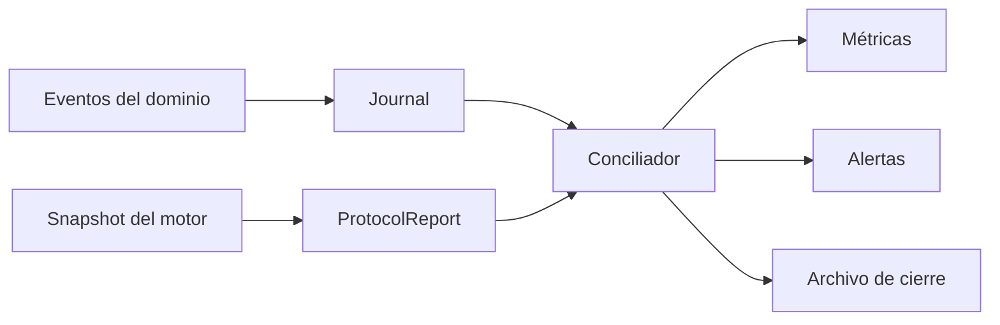
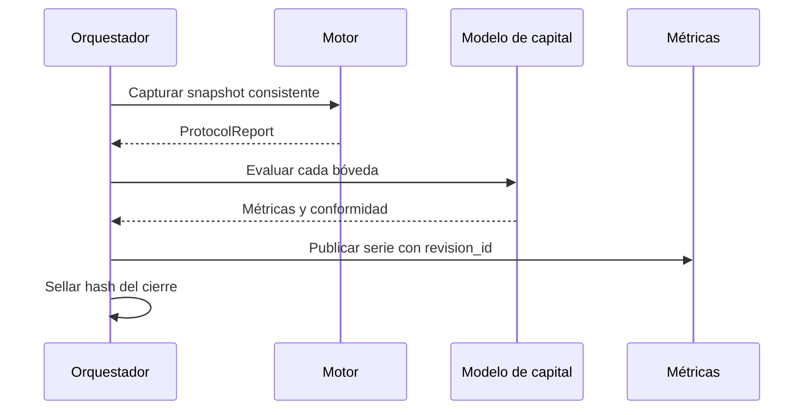
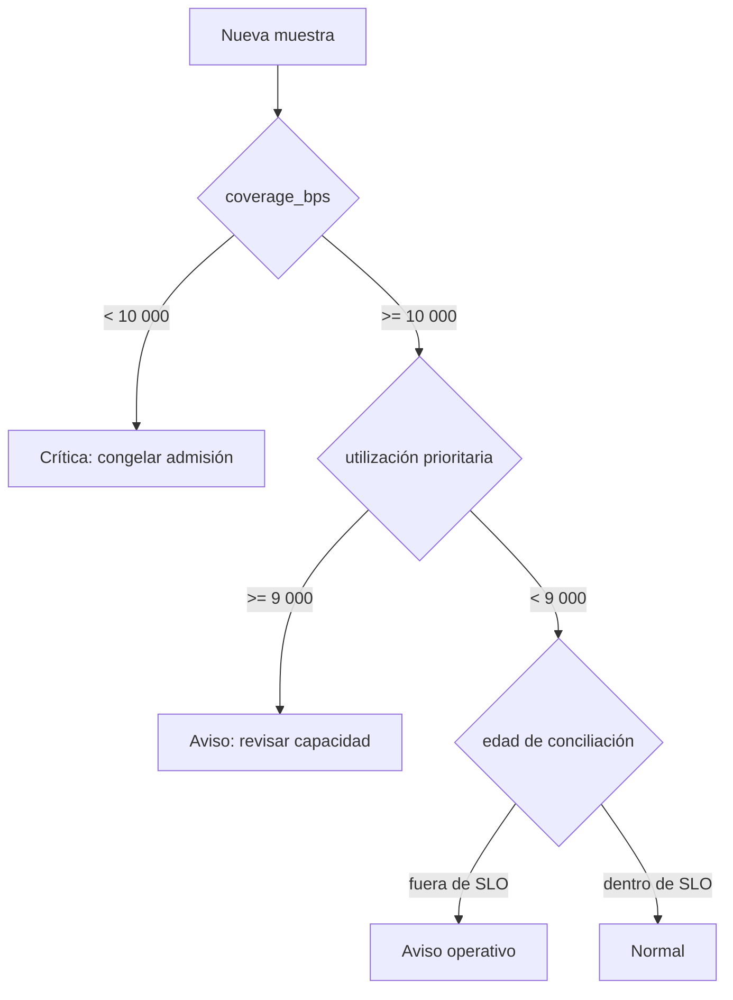

# Observabilidad

## Señales

La observabilidad se deriva de eventos de dominio y snapshots; no debe inferir contabilidad a partir de logs de texto. `ProtocolReport` expone el día, cuentas, bóvedas y número de eventos. `VaultReport` incorpora reserva, shares, activos pendientes, cola, derechos abiertos y estados de tickets.

## Métricas recomendadas

| Métrica | Tipo | Etiquetas acotadas |
| --- | --- | --- |
| `crown_reserve_assets` | gauge | `vault` |
| `crown_open_claims` | gauge | `vault` |
| `crown_queue_depth` | gauge | `vault`, `lane` |
| `crown_capital_coverage_bps` | gauge | `vault` |
| `crown_priority_utilization_bps` | gauge | `vault` |
| `crown_transition_total` | counter | `operation`, `result` |
| `crown_reconciliation_age_seconds` | gauge | `vault` |

Los IDs de cuenta, ticket e idempotencia no se usan como etiquetas. Pueden aparecer en trazas con acceso restringido y retención limitada.

## Conciliación

Cada ejecución asigna `revision_id`, día de epoch, commit de configuración y hash del snapshot. Un cierre incompleto no reemplaza el último cierre confirmado.

## Niveles de alerta

Una alerta crítica exige snapshot manual, bloqueo de nuevas admisiones en el adaptador y revisión de reservas antes de reanudar. Un aviso de capacidad no cambia automáticamente políticas: prepara una operación de gobierno con evidencia.

## Trazabilidad

Las trazas enlazan `request_id`, `operation_id`, `redemption_id` y `revision_id`. Los registros deben excluir payloads de autenticación. El journal es la fuente de secuencia; la plataforma de observación es una proyección y puede reconstruirse.
