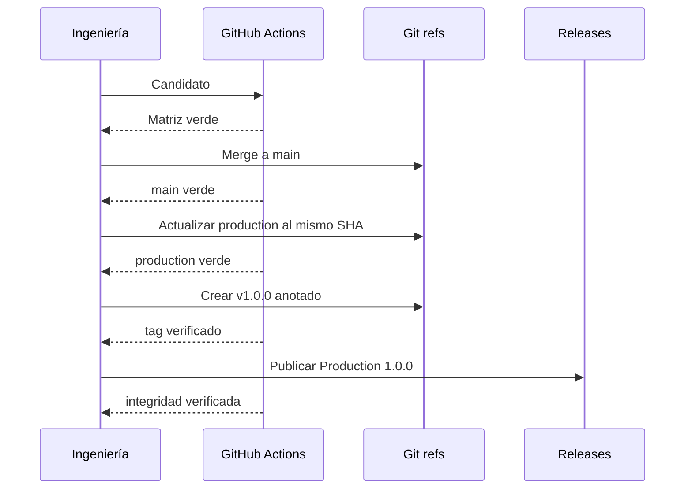
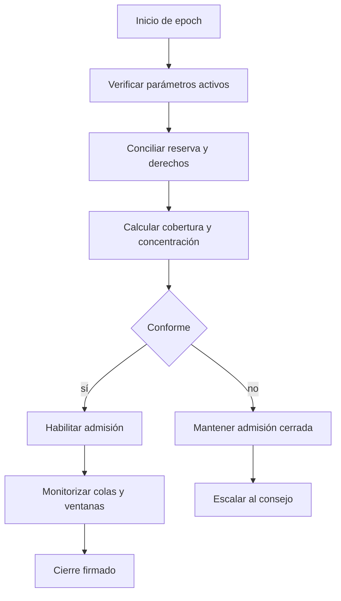

# Operaciones

## Preparación

Antes de habilitar una revisión, fija la toolchain, instala desde lockfiles y ejecuta la misma orden que CI:

```bash
npm ci
npm run ci
```

La ejecución verifica formato, build, Clippy con warnings como error, suites Rust y Node, artefactos del repositorio y dependencias de producción.


## Promoción

La promoción es inmutable: no se reconstruye código entre referencias. El commit aceptado en `main` se empuja a `production`; el tag anotado se crea sobre ese mismo SHA y la publicación usa ese tag. `Release integrity` compara las cuatro superficies.



Checklist de promoción:

1. Árbol de trabajo limpio y lockfiles actualizados.
2. Dos jobs de candidato verdes.
3. Revisión requerida satisfecha.
4. `main` verde en el commit de merge.
5. `production` apunta exactamente al mismo commit.
6. Tag anotado y publicación apuntan al mismo commit.
7. Workflow de integridad verde tras publicar.

## Rutina diaria



El cierre conserva snapshot, métricas, eventos desde el cierre anterior, configuración, commit y responsable. La hora del host no sustituye el `EpochDay` del dominio.

## Recuperación

Ante inconsistencia contable, se detiene la admisión en el adaptador, se preserva el estado, se captura el reporte y se reconstruye la secuencia desde el journal. No se corrigen saldos manualmente. La reanudación requiere causa explicada, transición aprobada y conciliación completa.

Para una indisponibilidad del adaptador, las órdenes con estado incierto se resuelven por clave de idempotencia. Nunca se crea una clave nueva para “forzar” una escritura cuyo resultado se desconoce.

## Rollback

El rollback de binario no implica rollback de estado. Una versión anterior solo puede leer estado si su esquema y semántica son compatibles. Los cambios de política se revierten mediante una nueva operación de gobierno; no se altera el historial.
